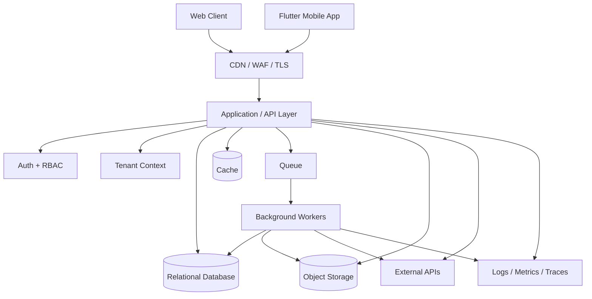
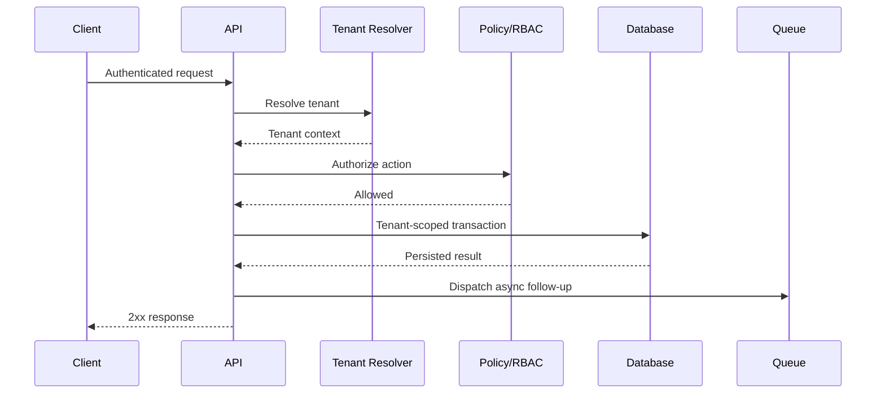

# SaaS Architecture Showcase

**A practical multi-tenant SaaS architecture reference covering tenancy, API design, queues, security, observability, scaling, storage, and mobile/web clients.**

This repository contains architecture documentation only. It intentionally excludes proprietary product source code, credentials, customer data, and internal business logic.

The architecture decision records are anonymized from real product work on a multi-tenant survey and field-data platform. They document context, alternatives, consequences, and verification—not just the preferred end state.

## What this demonstrates

- Multi-tenant SaaS system design
- Laravel/API-oriented backend architecture
- Web + Flutter/mobile client integration
- Queue workers and asynchronous jobs
- Object storage and media pipelines
- Role-based access control
- Tenant isolation strategies
- Audit logging and observability
- External API integration boundaries
- Deployment and scaling decisions
- Failure-mode thinking and recovery patterns

## Reference architecture

## Core design principles

### 1. Tenant context is explicit
Every authenticated request resolves a tenant before business logic executes. Tenant-aware queries are scoped centrally rather than relying on developers to remember filters in every controller.

### 2. Slow work leaves the request path
Exports, notifications, media processing, AI/API calls and other long-running work are pushed to queues. User-facing requests stay predictable even when third-party services are slow.

### 3. Integrations are isolated
External systems are accessed through service boundaries with timeouts, retries, idempotency and audit logs. A partner outage should not become a platform outage.

### 4. Security is layered
Authentication, authorization, tenant isolation, rate limiting, encrypted transport, secret management, audit logging and secure storage are treated as separate controls.

### 5. Operability is a feature
The platform should answer: What failed? For which tenant? Which request/job caused it? Was it retried? What changed? Without that, production debugging becomes guesswork.

## Documentation map

- [`docs/TENANCY.md`](docs/TENANCY.md) — tenant resolution and isolation
- [`docs/API-DESIGN.md`](docs/API-DESIGN.md) — request lifecycle, versioning and validation
- [`docs/ASYNC-JOBS.md`](docs/ASYNC-JOBS.md) — queues, retries, idempotency and dead-letter handling
- [`docs/SECURITY.md`](docs/SECURITY.md) — layered security controls
- [`docs/OBSERVABILITY.md`](docs/OBSERVABILITY.md) — logs, metrics, traces and audit events
- [`docs/DEPLOYMENT.md`](docs/DEPLOYMENT.md) — deployment topology and scaling
- [`docs/DATA-LIFECYCLE.md`](docs/DATA-LIFECYCLE.md) — retention, exports and object storage
- [`docs/FAILURE-MODES.md`](docs/FAILURE-MODES.md) — practical failure scenarios and responses

### Architecture decision records

- [`ADR 0001: Modular monolith before microservices`](docs/adr/0001-modular-monolith-before-microservices.md)
- [`ADR 0002: Explicit tenant context`](docs/adr/0002-explicit-tenant-context.md)
- [`ADR 0003: Idempotent mobile submissions`](docs/adr/0003-idempotent-mobile-submissions.md)
- [`ADR 0004: Object storage for survey media`](docs/adr/0004-object-storage-for-survey-media.md)
- [`ADR 0005: Queue boundaries`](docs/adr/0005-queue-boundaries.md)

## Example request lifecycle

## Technology-neutral, implementation-aware

The diagrams are intentionally portable, but the examples assume a modern backend stack such as Laravel/PHP with MySQL/PostgreSQL, Redis-compatible cache/queues, object storage, and web/mobile clients.

## Author

**Dagemawi Alemayehu**  
SaaS Architecture • Laravel • PHP • REST APIs • WordPress • Flutter
