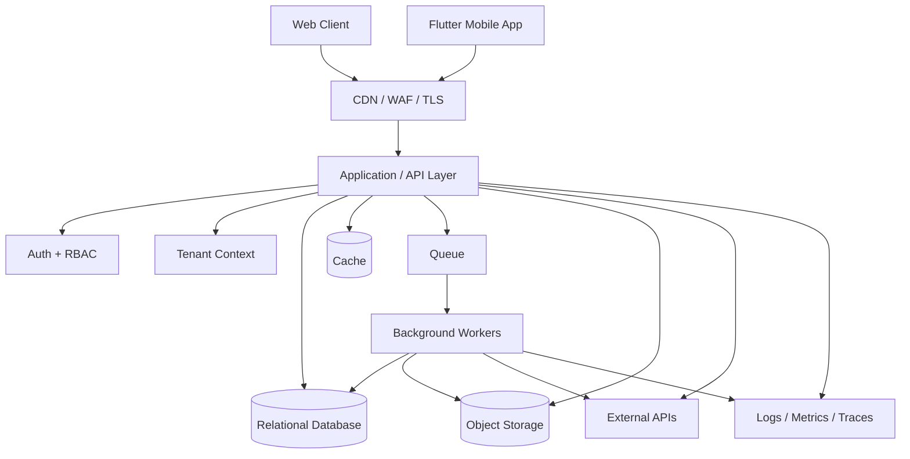
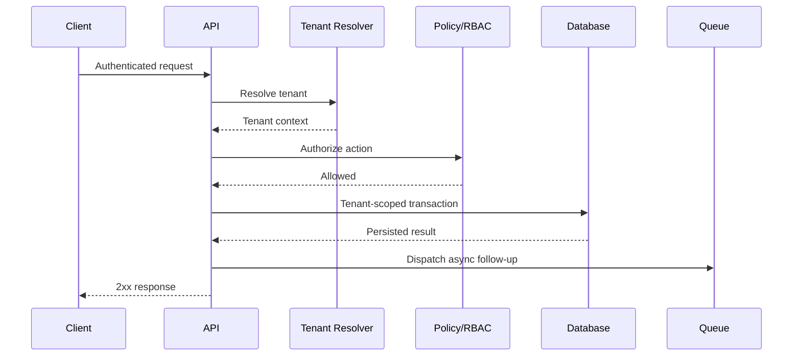

# SaaS Architecture Showcase

**A practical multi-tenant SaaS architecture reference covering tenancy, mobile submissions, API design, queues, security, observability, scaling, storage, and web/mobile clients.**

> **Important:** This is **not** the Dagu production repository and it contains **no Dagu application source code**. Dagu is a private commercial product. This repository only publishes sanitized architecture decisions and design notes that can be shared publicly.

This repository contains sanitized architecture documentation only. It intentionally excludes proprietary product source, credentials, customer data, private business rules, and claims about traffic or scale that are not publicly verifiable.

## What this demonstrates

- Multi-tenant SaaS system design
- Modular Laravel monolith boundaries
- Web and Flutter/mobile client integration
- Retry-safe mobile data submission
- Queue workers and asynchronous jobs
- Object storage and media pipelines
- Role-based access control
- Tenant isolation strategies
- Audit logging and observability
- External API integration boundaries
- Deployment and scaling decisions
- Failure-mode thinking and recovery patterns

## Reference architecture

## Core design principles

### 1. Tenant context is explicit

Every authenticated request resolves a tenant before business logic executes. Tenant-aware queries are scoped centrally rather than relying on developers to remember filters in every controller.

### 2. Boundaries do not require premature services

The product remains a modular monolith while domain boundaries are expressed through services, policies, jobs and events. A module is extracted only when operational evidence, ownership or regulatory requirements justify a network boundary.

### 3. Slow work leaves the request path

Exports, notifications, media processing, AI/API calls and other long-running work are pushed to queues. User-facing requests stay predictable even when third-party services are slow.

### 4. Retries have stable identity

A mobile timeout does not prove that the server rejected a request. Logical submissions and uploads therefore use persisted idempotency identities, server-side fingerprints, uniqueness constraints and explicit conflict handling.

### 5. Integrations are isolated

External systems are accessed through service boundaries with timeouts, retries, idempotency and audit logs. A partner outage should not become a platform outage.

### 6. Security is layered

Authentication, authorization, tenant isolation, rate limiting, encrypted transport, secret management, audit logging and secure storage are separate controls.

### 7. Operability is a feature

The platform should answer: What failed? For which tenant? Which request or job caused it? Was it retried? What changed? Without that, production debugging becomes guesswork.

## Architecture decision records

The ADRs show alternatives, costs and triggers—not only the selected design:

- [`ADR 0001 — Shared-schema tenancy`](docs/adr/0001-shared-schema-tenancy.md)
- [`ADR 0002 — Asynchronous external integrations`](docs/adr/0002-async-external-integrations.md)
- [`ADR 0003 — Object storage for uploads`](docs/adr/0003-object-storage-for-uploads.md)
- [`ADR 0004 — Modular monolith before microservices`](docs/adr/0004-modular-monolith-before-microservices.md)
- [`ADR 0005 — Idempotent mobile survey submissions`](docs/adr/0005-idempotent-mobile-survey-submissions.md)

## Documentation map

- [`docs/TENANCY.md`](docs/TENANCY.md) — tenant resolution and isolation
- [`docs/API-DESIGN.md`](docs/API-DESIGN.md) — request lifecycle, versioning and validation
- [`docs/ASYNC-JOBS.md`](docs/ASYNC-JOBS.md) — queues, retries, idempotency and dead-letter handling
- [`docs/SECURITY.md`](docs/SECURITY.md) — layered security controls
- [`docs/OBSERVABILITY.md`](docs/OBSERVABILITY.md) — logs, metrics, traces and audit events
- [`docs/DEPLOYMENT.md`](docs/DEPLOYMENT.md) — deployment topology and scaling
- [`docs/DATA-LIFECYCLE.md`](docs/DATA-LIFECYCLE.md) — retention, exports and object storage
- [`docs/FAILURE-MODES.md`](docs/FAILURE-MODES.md) — practical failure scenarios and responses

## Example request lifecycle

## Technology-neutral, implementation-aware

The diagrams are portable, but the examples assume a modern backend such as Laravel/PHP with MySQL or PostgreSQL, Redis-compatible cache/queues, object storage, and web/mobile clients.

This repository communicates engineering judgment; it is not a benchmark, production deployment, or substitute for executable code. The profile’s featured WordPress, Laravel integration, commerce and PHP domain repositories provide the public implementation and CI evidence.

## Author

**Dagemawi Alemayehu**  
SaaS Architecture • Laravel • PHP • REST APIs • WordPress • Flutter
