# API Design

## Request pipeline

```mermaid
flowchart LR
    R[Request] --> RATE[Rate Limit]
    RATE --> AUTH[Authenticate]
    AUTH --> TENANT[Resolve Tenant]
    TENANT --> VALIDATE[Validate]
    VALIDATE --> AUTHORIZE[Authorize]
    AUTHORIZE --> SERVICE[Domain Service]
    SERVICE --> TX[Database Transaction]
    TX --> RESOURCE[API Resource]
    RESOURCE --> RESP[Response]
```



## Conventions

- Version public APIs when compatibility matters.
- Use request validators instead of validating ad hoc in controllers.
- Keep controllers thin; orchestration belongs in application/domain services.
- Return stable error shapes.
- Use idempotency keys for side-effecting endpoints that clients may retry.
- Add correlation/request IDs to responses and logs.
- Paginate collection endpoints.
- Prefer explicit state transitions over allowing clients to update arbitrary status fields.

## Example error shape

```json
{
  "error": {
    "code": "record_not_editable",
    "message": "This record can no longer be edited.",
    "request_id": "req_01J..."
  }
}
```

## External API clients

Wrap third-party APIs behind adapters. Do not scatter SDK calls through controllers and jobs. Each adapter should define timeouts, retry rules, authentication, response normalization and failure logging.
