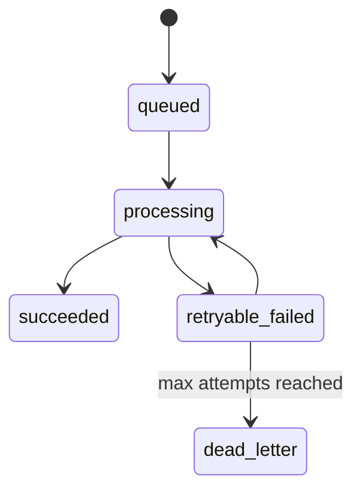

# Asynchronous Jobs

Queues protect request latency and isolate unreliable external dependencies.

## Good queue candidates

- Email/SMS/push notifications
- Exports and report generation
- Image/document processing
- AI analysis
- Webhook delivery
- Large imports
- Search indexing
- Data synchronization

## Delivery lifecycle

## Reliability controls

### Idempotency
A retried job must not duplicate irreversible side effects. Store stable operation keys or guard state transitions in the database.

### Backoff
Fast repeated retries can amplify an outage. Use increasing delays and cap attempts.

### Dead-letter handling
Terminal failures should remain visible and recoverable. Capture the tenant, job type, entity ID, attempt count and final error.

### Transaction boundary
If a job depends on data written in the current transaction, dispatch it only after commit.

### Timeouts
Worker timeout must be larger than the job's own HTTP/client timeout, but finite. Never allow indefinite external calls.
