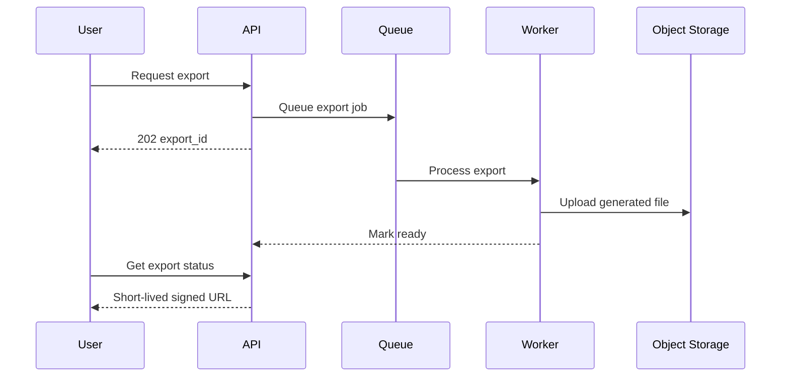

# Data Lifecycle

## Categories

Different data needs different lifecycle rules:

- core transactional records
- user-generated uploads
- generated exports
- logs
- audit events
- analytics aggregates
- temporary processing artifacts

## Retention

Define retention by business/security need rather than keeping everything forever. Temporary exports and processing artifacts are strong candidates for automatic expiry.

## Export pattern

## Deletion

Deletion workflows should account for database records, object storage, search indexes, cached representations, analytics copies and downstream integrations.
