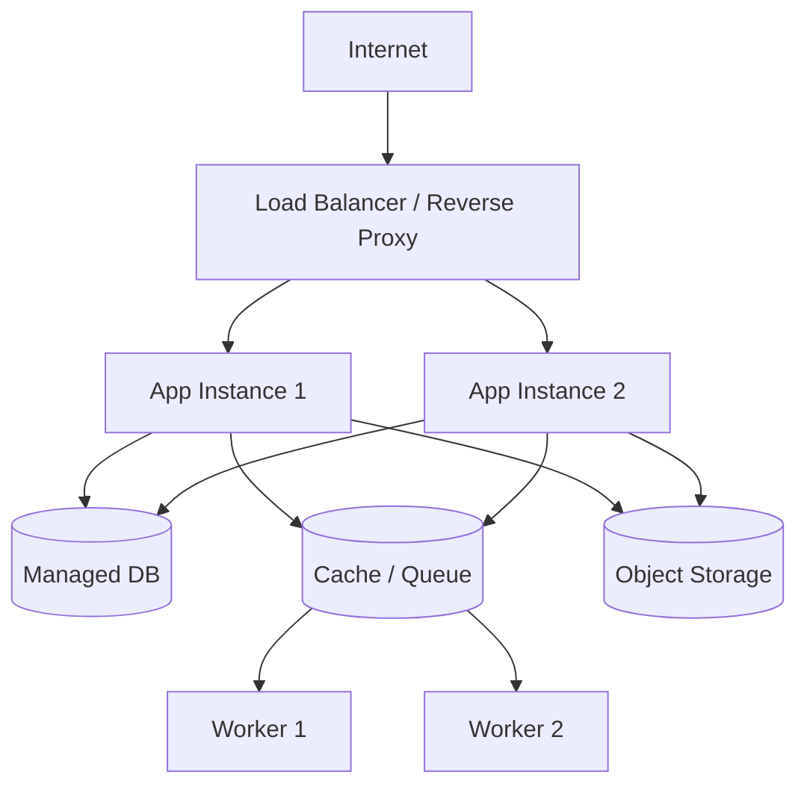

# Deployment and Scaling

## Baseline topology

## Stateless application layer

Do not depend on local disk or in-memory session state if multiple application instances may serve traffic. Store sessions/cache externally and files in object storage.

## Scaling order

1. Measure the actual bottleneck.
2. Optimize expensive queries and remove accidental N+1 patterns.
3. Add/size cache where it has clear value.
4. Scale workers independently from web traffic.
5. Scale app instances horizontally.
6. Scale database resources/read patterns only when evidence requires it.

## Deployment safety

- Run automated tests before deploy.
- Use backward-compatible migrations when rolling deploys are possible.
- Separate build and runtime configuration.
- Health checks should verify application readiness, not just that a process exists.
- Keep rollback paths for code and database changes.
