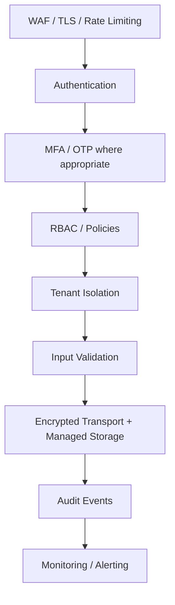

# Security Architecture

Security is layered; no single control is sufficient.

## Layers

## Authentication

- Use framework-supported password hashing.
- Rotate/revoke tokens and sessions.
- Support MFA for privileged users where practical.
- Treat password reset and email/phone verification as security-sensitive flows.

## Authorization

Authentication answers *who are you?* Authorization answers *may you do this?* Every sensitive domain action should pass a policy/permission check.

## Tenant isolation

Authorization and tenant scope are separate checks. A user can be authenticated and authorized for a role but still must not access another tenant's resource.

## Secrets

- Environment/secret manager, never source control.
- Separate credentials by environment.
- Rotate integration secrets.
- Do not log access tokens or raw secrets.

## Audit events

Record privileged changes such as role updates, exports, login-security changes, integration configuration and destructive actions.

## Uploads

Validate MIME/type, size and ownership; store outside the executable web root; generate randomized object names; use short-lived authorized access URLs.
