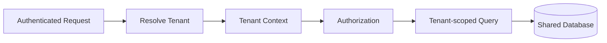

# Tenancy and Isolation

## Goal

Prevent accidental or malicious cross-tenant data access while keeping the application maintainable as the number of features grows.

## Recommended baseline: shared database, shared schema

For many B2B SaaS products, a shared schema with a `tenant_id` discriminator provides a good balance of cost, operational simplicity and query flexibility.



## Rules

1. Resolve the tenant from authenticated membership, not from an arbitrary request parameter alone.
2. Attach tenant context before domain/business logic executes.
3. Scope queries centrally using repositories, global scopes or explicit domain services.
4. Put `tenant_id` on tenant-owned tables even when ownership could be inferred indirectly. This improves defensive filtering and operational querying.
5. Include tenant identity in cache keys, job payloads, audit events and object-storage paths.
6. Test isolation as a first-class security property.

## Background jobs

Jobs must carry explicit tenant context because they execute outside the original HTTP request.

```text
ProcessExportJob
- tenant_id
- user_id
- export_id
```

The worker re-establishes tenant context before reading or writing data.

## Object storage

Use tenant-aware prefixes:

```text
tenants/{tenant_uuid}/projects/{project_uuid}/attachments/{file_uuid}
```

Signed URLs should be short-lived and authorized before generation.

## When to move to database-per-tenant

Consider stronger physical isolation when contractual, regulatory, residency or very large-customer requirements outweigh the operational cost. Do not adopt database-per-tenant only because it sounds more "enterprise"; migrations, connection management, backups and analytics become substantially more complex.
